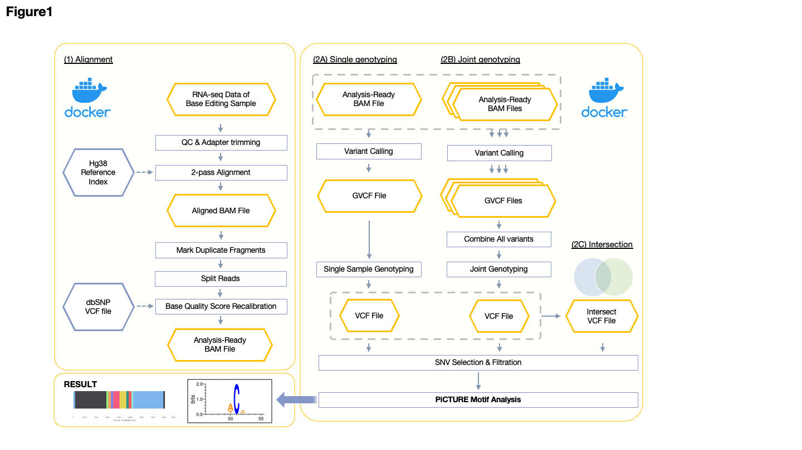
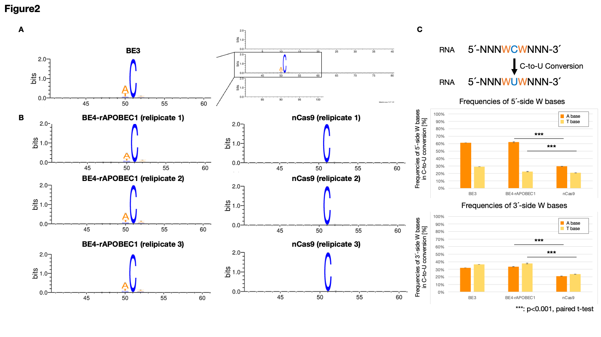
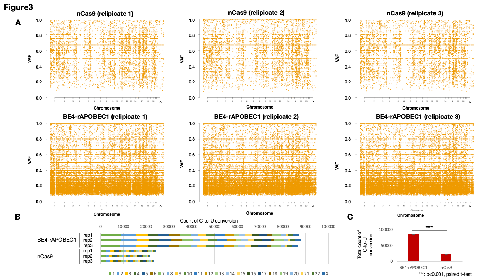

# Abstract

Base Editor, a technique that utilizes Cas9 nickase fused with deaminase to introduce single base substitutions, has significantly facilitated the creation of valuable genome variants in medical and agricultural fields. However, a phenomenon known as RNA off-target effects is recognized with Base Editor, resulting in unintended substitutions in the transcriptome. It has been reported that such substitutions often occur in specific base motifs (WCW), but whether these motif mutations are dominant has not been investigated. In this study, we constructed a pipeline for analyzing RNA off-target effects, called the Pipeline for CRISPR-induced Transcriptome-wide Unintended RNA Editing (PiCTURE), and analyzed RNA-seq data previously reported. We found that the RNA off-target effects associated with the reported base motifs were minimal, and the majority were indistinguishable from motif analysis. Consequently, we trained a Large Language Models (LLM) specialized for DNA base sequences on RNA off-target sequences and developed a classifier for assessing the risk of RNA off-target effects based on the sequences. When the model's estimations were applied to the RNA off-target data for BE4-rAPOBEC1 and BE4-RrA3F, satisfactory determination results were obtained. This study is the first to demonstrate the efficacy of machine learning approaches in determining RNA off-target effects caused by Base Editor and presents a predictive model for safer use of Base Editor.

# Introduction

Base Editor is one application of CRISPR-Cas9 technology[1]. It is a tool that fuses deaminase enzymes such as APOBEC1 with Cas9 nickase or dCas9. The Base Editor binds to genomic DNA that specifically binds to about 20 base guide RNAs and PAM sequences and induces specific substitutions in a few base pairs upstream from PAM. The Cytocine Base Editor catalyzes the deamination reaction with cytosine as a substrate and converts it to uracil. This uracil is interpreted as thymine by polymerase on genomic DNA, resulting in a C to T base substitution. Base Editor has dramatically facilitated the construction of one base genome variations that express phenotypes such as pathogenic SNPs, and it is used in gene therapy and breed improvement research.
However, the deaminase enzyme used by the Base Editor inherently includes the property of incorporating RNA as a substrate, and it has been reported that it similarly causes C to U conversions in the transcriptome (RNA off-target)[2][3]. This conversion is known to occur notably against the ACW motif in the case of BE3[2], and improved versions such as BE4-rAPOBEC1, and BE4-RrA3F have been developed against it[3]. Although these have reduced RNA off-targets, the orientation to the ACW motif and the overall picture of RNA off-target itself have not been clarified in detail. Also, the detection of RNA off-targets is based on RNA-seq, but this method is carried out by homemade analysis by each research group, and there is no platform to evaluate objectively and uniformly[2][3].
Therefore, in this study, we constructed the short-read human RNA-seq analysis pipeline Pipeline for CRISPR-induced Transcriptome-wide Unintended RNA Editing (PiCTURE) to detect RNA off-targets. Using PiCTURE, we attempted to detect RNA off-targets of BE3, BE4-rAPOBEC1, and BE4-RrA3F reported in previous studies. From there, we redefined the base motif, and by using the detected RNA off-target data and the negative control data introducing nCas9, we attempted more complex pattern recognition by machine learning. This study aimed to achieve more comprehensive and objective evaluation of RNA off-targets and the generalization of their regularity.

# Materials and Methods

## RNA-seq dataset

The RNA-seq data was acquired from the Sequence Read Archive (SRA). We obtained SRR8096262 as BE3 transfection data. For the BE4-rAPOBEC1 transfection data, we secured SRR11561273, SRR11561298, and SRR11561324. As for BE4-RrA3F transfection data, we gathered SRR11561293, SRR11561291, and SRR11561288. Additionally, for the negative control, we procured SRR11561326, SRR11561314, and SRR11561289 as nCas9 transfection data. A comprehensive list of all the sequencing files utilized in this study is presented in Table 1.

### Table1

| SRA ID | Tool | Replicate | Training/Test dataset | Ref |
| -------- | -------- | -------- | -------- | -------- |
| SRR8096262 | BE3 | - | - | [2] |
| SRR11561273 | BE4-rAPOBEC1 | 1 | Training dataset | [3] |
| SRR11561298 | BE4-rAPOBEC1 | 2 | Training dataset | [3] |
| SRR11561324 | BE4-rAPOBEC1 | 3 | Test dataset | [3] |
| SRR11561293 | BE4-RrA3F | 1 | - | [3] |
| SRR11561291 | BE4-RrA3F | 2 | - | [3] |
| SRR11561288 | BE4-RrA3F | 3 | - | [3] |
| SRR11561326 | nCas9 | 1 | Training dataset | [3] |
| SRR11561314 | nCas9 | 2 | Training dataset | [3] |
| SRR11561289 | nCas9 | 3 | Test dataset | [3] |

## RNA off-target analysis using PiCTURE

The following describes our pipeline for RNA off-target analysis conducted using PiCTURE (Figure 1). All pipeline tasks were executed on a Docker image, implemented on an Ubuntu 22 system with 235GB RAM.
Initially, the Alignment process was performed as follows: Quality Control (QC) and Adapter trimming for paired-end reads were conducted using Trim Galore(v0.6.7). Subsequently, the reads were mapped to the hg38 genome using STAR(v2.7.4a)[4], outputting the resultant bam files, followed by a two-pass alignment execution. Base Quality Score Recalibration was then performed based on dbSNP, utilizing the GATK4(v4.3.0.0) BaseRecalibrator[5].
Next, variant calling was carried out. After haplotype prediction using GATK4's HaplotypeCaller, a database was constructed using GenomicsDBImport with the resultant data. PiCTURE provides a scheme to construct a database with a single RNA-seq data (Single genotyping) and a scheme to construct a database with multiple RNA-seq data (Joint Genotyping, Intersection). In this study, all data processing was conducted using Single genotyping. Finally, variant calling was performed with GenotypeGVCFs, outputting a VCF file.
We then performed SNP extraction on the output VCF file using SelectVariants and acquired variants that satisfied the conditions of "QD < 2.0, QUAL < 30.0, SOR > 3.0, FS > 60.0, MQ < 40.0, MQRankSum < -12.5, ReadPosRankSum < -8.0" using VariantFiltration. We employed a custom script named "extract_flanking_seq_from_vcf.py" to retrieve ±50bp genomic sequences surrounding each variant, categorizing them according to the substitution pattern. For each set of sequence data corresponding to each substitution pattern, we executed base motif estimation using WebLogo(v3.7.12). We then calculated variant allelic fractions (VAF) using bcftools, partitioned the data according to a threshold of 0.8, and performed motif estimation as described above for each partition. Validation of each VCF file was performed using MultiQC(v1.14).
All the hg38 genome reference, index data, and dbSNP data used in this analysis were derived from the GATK resource bundle (https://gatk.broadinstitute.org/hc/en-us/articles/360035890811-Resource-bundle).

## Preparation of Learning Dataset
The learning data comprised of genomic sequence information ±20bp surrounding the points where C to T (U) substitutions occurred in the samples transfected with BE4-rAPOBEC1 (Positive) and nCas9 (Negative). The data, variant-called by PiCTURE, from biological replicates 1 and 2 were utilized respectively, with a total of 87,018 (replicate 1) and 88,160 (replicate 2) for Positive data, and 24,314 (replicate 1) and 21,870 (replicate 2) for Negative data. For BE4-rAPOBEC1 (Positive), the sites that overlapped with the nCas9 (Negative) data in terms of sequence were excluded from the Positive data. Consequently, the sequence information of XXX sites surrounding the sites where C to T (U) substitutions occurred in BE4-rAPOBEC1 and XXX sites in nCas9 were used as learning data. On the other hand, for the test data, we used 86,517 cases for BE4-rAPOBEC1 and 23,568 cases for nCas9.

## Training and Validation

Once the dataset is established, the study engages in training and validation processes using advanced machine learning algorithms. Once the dataset is established, we performed DNA-BERT [6] embedding to convert the data into feature vectors. During the conversion, we utilized models with kmer values of 3, 4, 5, and 6. We used the average value of the sequence output from the final layer for embedding, resulting in a 768-dimensional representation of the sequences. We divided the dataset into 80% for training data and 20% for test data.
For the machine learning model, we employed logistic regression. Since the target data was imbalanced, we applied weighted learning based on the frequency of labels during training. We conducted 5-fold cross-validation, performed training on the training data, and evaluated the performance on the test data.

## Visualization

This study utilized GitHub for the management and sharing of the code and materials, which are available at the following repository: https://github.com/KazukiNakamae/BioHackJP/tree/MLBE_visualize.
The visualization workflow was constructed using the R programming language (https://www.r-project.org/) and the Snakemake workflow management system (https://snakemake.readthedocs.io/).
The input data consisted of RNA off-target frequency information. This data contains position and frequency information for RNA mutations introduced by each base editor in the sample. Each data point within a sample is tied to a position on a chromosome. The data was formatted in Variant Call Format (VCF) files, which include Variant Allele Frequency (VAF) values.
For visualization, the RNA mutation data was filtered to include only those with the reference (REF) base as 'C' and the alternative (ALT) base as 'T'. The R package "qqman", specifically the "manhattan" function, was employed to visualize frequency information on a chromosome map (https://cran.r-project.org/web/packages/qqman/index.html). The R script for visualization, vcf_to_mplot.R, was run through the following link: https://github.com/KazukiNakamae/BioHackJP/blob/MLBE_visualize/src/vcf_to_mplot.R.
Snakemake was used to facilitate parallel execution of the visualization and easy alteration of parameters. The code for Snakemake can be viewed at https://github.com/KazukiNakamae/BioHackJP/blob/MLBE_visualize/workflow/vcf_to_mplot.smk.
The output of the workflow was .png files for each sample, displaying Manhattan plots. The y-axis represents the 'Frequency of RNA mutation', while the x-axis represents the 'Position on the chromosome'. Each point on the plot denotes a single base where mutation occurred.
All scripts and additional materials necessary for replicating the analysis are available in the aforementioned GitHub repository.

# Results

## Observation of RNA off-target C to U mutations using PiCTURE

Initially, we constructed a pipeline, termed the Pipeline for CRISPR-induced Transcriptome-wide Unintended RNA Editing (PiCTURE) (Figure 1), for uniformly detecting RNA off-targets. Using this pipeline, we analyzed BE3 data, which are reported to contain a substantial number of RNA off-targets. Consequently, a WCW (including ACW) motif was identified (Figure 2A-C). However, the motif had relatively low strength, suggesting that only a minority of RNA off-targets may be motif-dependent. Furthermore, we observed RNA off-targets using BE4 with the addition of the improved version of BE3, rAPOBEC1. Here, we confirmed the existence of a W base motif on the 5’ side of the C base (Figure 2B), but the intensity of the motif on the 3’ side was extremely weak. When observing C to T mutations occurring across the whole transcriptome (Figure 3A-C), we found 86876, 88017, and 86390 mutations distributed across all chromosomes in each replicate. Compared to samples introducing nCas9, there was an approximate more than 3-fold increase, verifying that BE4-rAPOBEC1 induces C to U mutations across the entire transcriptome.

## Prediction of RNA off-targets using LLM

Given these observations, it is challenging to entirely predict RNA off-targets through uniform motif analysis, and understanding and controlling their risk remains difficult. Therefore, we attempted to predict sequence patterns that BE4-rAPOBEC1 preferably reacts with, using machine learning to better capture C to U mutations triggered across the whole transcriptome. Recently, DNA-BERT, a type of Large Language Models (LLM) for machine learning on nucleic acid base sequences, has recorded excellent results in promoter identification, etc. We attempted to use this algorithm for general learning of C to U RNA off-target patterns.  As a result of the training, we successfully classified the test data (positive n=29087, negative n=6904, 5 Cross validation) with an accuracy of AUC=0.71. We named this model the BERT-assisted Base Editor-mediated RNA Targeting model (BERT BERT; BERTs) v1. We then applied this to off-target-suppressing BE4, BE4-RrA3F, with an introduced F130L mutation to rAPOBEC1, and successfully classified C to U RNA off-targets with an accuracy of AUC=0.62. These results suggest that BERTs v1 can make judgments based on an adequate generalization of RNA off-target patterns induced by cytosine deaminase enzymes.

# Conclusion

This study is the first to demonstrate the efficacy of a machine learning approach in predicting RNA off-targets caused by Base Editors, and it provides a predictive model to ensure safer use of Base Editors. The BERTs v1 model developed in this study is distributed via a Github repository, making it possible for all researchers utilizing Base Editors to treat RNA off-targets as more predictable entities.

# Future work

The field of predicting RNA off-targets through machine learning is underdeveloped, and we anticipate the need for the construction of models for various Base Editors, including Adenine Base Editor (ABE)[7], DddA-derived cytosine base editors (DdCBEs)[8], C-to-G base editors (CGBE)[9], and zinc finger deaminases (ZFD)[10]. At the same time, it is necessary to deepen our understanding of the rules of sequence recognition by deaminase enzymes.
In DNA-BERT, it is possible to closely examine the hidden layers, which we believe can be instrumental in identifying critical elements for pattern recognition.
Furthermore, we plan to apply BERT² v1 to transcriptome annotations according to cell tumor types to build a transcriptome hazard map predicting phenotypic risks arising from Base Editors. This endeavor aims to visualize potential risks that could emerge in the industrial use and clinical application of base editors.

## Acknowledgements

The construction of PiCTURE was carried out with the guidance of Hidemasa Bono from Hiroshima University and Yuki Naito and Hiromasa Ono from DBCLS. We would like to express our gratitude to the organizing committee of BioHackathon 2023 for organizing our group and facilitating our research environment.

## References

1. Komor, Alexis C., et al. "Programmable editing of a target base in genomic DNA without double-stranded DNA cleavage." Nature 533.7603 (2016): 420-424.
2. Grünewald, Julian, et al. "Transcriptome-wide off-target RNA editing induced by CRISPR-guided DNA base editors." Nature 569.7756 (2019): 433-437.
3. Yu, Yi, et al. "Cytosine base editors with minimized unguided DNA and RNA off-target events and high on-target activity." Nature Communications 11.1 (2020): 2052.
4. Dobin, Alexander, et al. "STAR: ultrafast universal RNA-seq aligner." Bioinformatics 29.1 (2013): 15-21.
5. Poplin, Ryan, et al. "Scaling accurate genetic variant discovery to tens of thousands of samples." BioRxiv (2017): 201178.
6. Ji, Yanrong, et al. "DNABERT: pre-trained Bidirectional Encoder Representations from Transformers model for DNA-language in genome." Bioinformatics 37.15 (2021): 2112-2120.
7. Gaudelli, Nicole M., et al. "Programmable base editing of A• T to G• C in genomic DNA without DNA cleavage." Nature 551.7681 (2017): 464-471.
8. Mok, Beverly Y., et al. "A bacterial cytidine deaminase toxin enables CRISPR-free mitochondrial base editing." Nature 583.7817 (2020): 631-637.
9. Kurt, Ibrahim C., et al. "CRISPR C-to-G base editors for inducing targeted DNA transversions in human cells." Nature biotechnology 39.1 (2021): 41-46.
10. Lim, Kayeong, Sung-Ik Cho, and Jin-Soo Kim. "Nuclear and mitochondrial DNA editing in human cells with zinc finger deaminases." Nature Communications 13.1 (2022): 366.